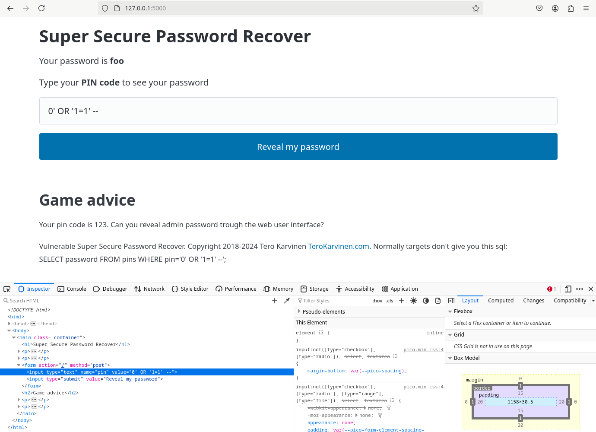

# h2 - Break & unbreak

## x) Lue/katso/kuuntele ja tiivistä

### OWASP Top 10: A01 Broken Access Control
- Broken Access Control, eli rikkinäiset käyttöoikeudet on yleisin haavoittuvuus OWASP Top 10 listalla
- Broken Access Control johtaa siihen, että käyttäjät pääsevät käsiksi sovelluksen sisältöön, joihin heillä ei ole oikeutta päästä
- Toimintoihin liittyy olennaisesti tietojen luvaton näkeminen, paljastaminen, muuttaminen sekä poistaminen.
- Parhaimmat tavat estää on: Luotettavan palvelinpuolen koodin käyttäminen, estä oletuksena pääsy kaikkiin resursseihin paitsi julkisiin sekä toteuttaen pääsynhallinta kerran ja käytäen sitä uudelleen koko sovelluksessa, samalla minimoiden CORS-käyttö.
### Karvinen 2023: Find Hidden Web Directories - Fuzz URLs with ffuf
- Fuff on joohoi:n kehittämät web fuzzer
- Fuff avulla voi löytää web-palvelimilta piilotettuja hakemistoja, otsikoita tai POST-parametrejä
- Fuffia voi testata paikallisesti ilman internet-yhteyttä. Tärkeää onkin muistaa, että penetraatiotestauksen teknkiikoiden käyttö tulee suorittaa lain sekä eettisten perjaatteiden puitteissa.
### PortSwigger: Access control vulnerabilities and privilege escalation
- Artikkelissa käsitellään pääsynhallintaa ja se on jaettu kahteen eri pystysuoraan & vaakasuoraan pääsynhallintaan.
- Pystysuora pääsynhallinta rajoittaa pääsyä tiettyihin toimintoihin käyttäjätyypin mukaan, esimerkiksi jaottelua ylläpitäjien ja tavallisten käyttäjien välillä
- Vaakasuora pääsynhallinta rajoittaa pääsyä resursseihin tiettyjen käyttäjien välillä, kuten esimerkiksi käyttäjän omiin pankkitileihin ja siirtoihin liittyviin tietoihin
- Pääsynhallintaa voidaan rikkoa useilla eri tavoilla, näistä artikkeleissa on muutamia esimerkkejä.
- Käyttäjä pääsee käsiksi toimintoihin, joihin hänellä ei ole oikeutta kuten esimeriksi tavallinen käyttäjä pääsee admininstrator-sivulle. Tätä kutsutaan pystysuoran pääsynhallinnan rikkomiseksi.
- Suojaamaton toiminnallisuus on hyvin yleinen tapa rikkoa pääsynhallintaa. Tässä tavassa esimerkiksi administrator sivuja ei ole suojattu pääsyltä ja niihin pääsee käsiksi kuka vain syöttämällä oikean osoitteen
### Karvinen 2006: Raportin kirjoittaminen
- Raportin tulisi olla täsmällinen ja toistettava. Raportissa tulisi atkiivisesti kertoa mitä teit ja mitä tapahtui. Raportin kirjoittaminen työtä tehdessä on suositeltavaa.
- Raportissa olisi hyvä myös sisällyttää ympäristö, jossa työ tehtiin, koska monet asiat ja mahdolliset ongelmat toimivat sekä ilmenevät eri tavalla tietokoneissa ja verkoissa.
- Kirjoita menneessä aikamuodossa ja kerro tarkasti, mitä komentoja annoit tai mitä klikkasit. Raportoi kaikki tulokset ja mahdolliset viat ohjelmissa, työkaluissa ja laitteissa.
- Raportin tulee olla helppolukuinen. Käytä väliotsikoita, kirjoita selkeää kieltä ja viittaa mahdollisiin lähteisiin.
- Vältä sepittämistä, plagiointia ja kuvien luvatonta käyttöä.
### Vapaaehtoinen: PortSwigger 2020: What is SQL injection? - Web Security Academy

## Rauta & HostOS

- Asus X570 ROG Crosshair VIII Dark Hero AM4
- AMD Ryzen 5800X3D
- G.Skill DDR4 2x16gb 3200MHz CL16
- 2x SK hynix Platinum P41 2TB PCIe NVMe Gen4
- Sapphire Radeon RX 7900 XT NITRO+ Vapor-X
- Windows 11 Home

## a) Murtaudu 010-staff-only
Tehtävää suoritin Debian 12 virtuaalikoneen puolella. Tehtävää edeltävästi asensin tarvittavat python3-flask & python3-flask-sqlalchemy paketit.

      sudo apt-get -y install python3-flask python3-flask-sqlalchemy

Purettuani tehtäväpaketin kansioon, suoritin staff-only.py ohjelman ja avasin sen Firefox selaimessa localhost osoitteesta.

Testailin alkuun eri numerosarjoja, mutta niillä ei kovin pitkälle päässyt. Yritin heti perään syöttää SQL tekstiä, mutta tekstikenttään pystyi syöttämään vain numeroita.

Lähdin taklaamaan ongelmaa avaamalla F12 näppäimellä Inspector näkymän ja valitsin syötekentän. Muokkasin input type number -> text. Tällä tavalla pystyis syöttämään myös tekstiä kenttään. 

Yritin ensimmäisenä syöttää kenttään:

      0'+OR+1=1 --

Mutta palautteena sain vain Internal Server Erroria, joten paluu mietintämyssyyn edessä. Muokkailin hieman syötteen rakennetta ja yllätyksekseni sain vastaukseksi foo.

      0' OR '1=1'--

Foo, mikä ihmeen foo? Pitkän tovin mietiskelin, mutta en keksinyt mitään jatkoa lauseelle millä paljastaisin muita salasanoja. Teron vinkeistä löysin kuitenkin ratkaisun mietiskelyyn ja rupesin kokeilemaan lisäämällä LIMIT loppuun.

      0' OR '1=1' LIMIT 2,1 --

BINGO. Sieltähän se SUPERADMIN paljastui ruudulle toisella yrittämällä.

## b) Korjaa 010-staff-only haavoittuvuus lähdekoodista

## c) Ratkaise dirfuzt-1

## d) Murtaudu 020-your-eyes-only

## e) Korjaa 020-your-eyes-only haavoittuvuus

## g) Ratkaise Portswigger Academyn "Lab: SQL injection vulnerability in WHERE clause allowing retrieval of hidden data".

## h) Ratkaise Portswigger Academyn "Lab: SQL injection vulnerability allowing login bypass"

## Lähteet
OWASP Top 10:2021. A01:2021 – Broken Access Control. Luettavissa: https://owasp.org/Top10/A01_2021-Broken_Access_Control/ Luettu: 31.10.2024

Karvinen T. Raportin kirjoittaminen 2016. Tero Karvisen verkkosivut. Luettavissa: https://terokarvinen.com/2006/raportin-kirjoittaminen-4/ Luettu: 31.10.2024

Nurminen Kasper GitHub. Linux Kurssin viikkotehtävä. Luettavissa: https://github.com/nurminenkasper/Linux-palvelimet/blob/main/h1-oma-linux.md Luettu: 31.10.2024

Karvinen T. Find Hidden Web Directories - Fuzz URLs with ffuf. Tero Karvisen verkkosivut. Luettavissa: https://terokarvinen.com/2023/fuzz-urls-find-hidden-directories/ Luettu: 31.10.2024

Portswigger Access control vulnerabilities and privilege escalation. Luettavissa: https://portswigger.net/web-security/access-control Luettu: 31.10.2024

Karvinen T. Hack'n Fix. Tero Karvisen verkkosivut. Luettavissa: https://terokarvinen.com/hack-n-fix/ Luettu 1.11.2024

