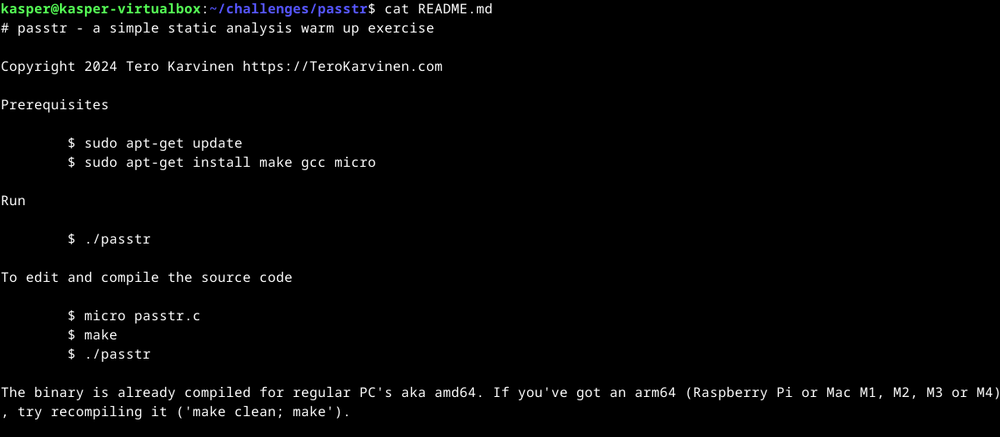
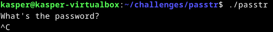
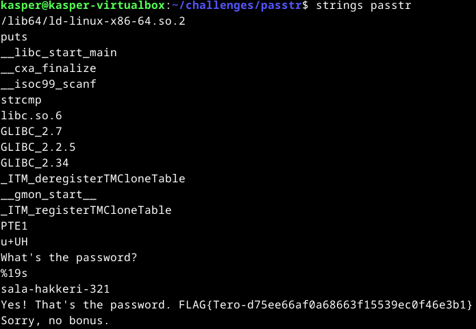
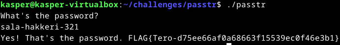
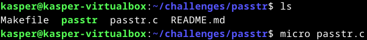
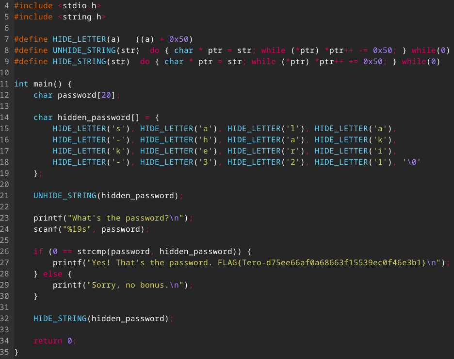
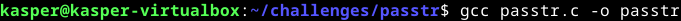
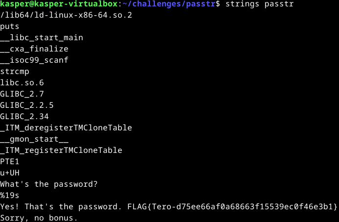

# h3 - No strings attached

## Rauta & HostOS

- Asus X570 ROG Crosshair VIII Dark Hero AM4
- AMD Ryzen 5800X3D
- G.Skill DDR4 2x16gb 3200MHz CL16
- 2x SK hynix Platinum P41 2TB PCIe NVMe Gen4
- Sapphire Radeon RX 7900 XT NITRO+ Vapor-X
- Windows 11 Home

## a) Strings & passtr

Lähdin tarkastelemaan tehtävää ihan puhtaasti kansiosta löytyvästä README.md tiedostosta. Sieltä löytyikin muutamat vinkit tarpeellisiin asioihin. 

        cat README.md

Testailin tietenkin alkuun mitä kyseinen passtr tekee.

        ./passtr

Okei, mikä salasana on? Tiedossa oli, että salasanaa piti ruveta selvittämään Strings avulla, oli itselle ensin selvennettävä miten ja miksi sitä tarkalleen käytetään. Käytännössä Strings komennolla haetaan binääristä luettavissa olevat tekstit. Lähdin siis suorittamaan strings komentoa seuraavaksi kansiosta löytyvään passtr.

        strings passtr

Sieltähän löytyi vaikka mitä tietoa, mutta selvästi myös salasana sala-hakkeri-321. Testataan vielä, että se toimii suorittaessa.

        ./passtr

Yes, That's the password. Toimiihan se tosissaan.

Lippu: FLAG{Tero-d75ee66af0a68663f15539ec0f46e3b1}

## b) passtr.c -ohjelmasta uusi versio

DISCLAIMER! Tehtävän ratkaisussa on hyödynnetty lyödettyjen lähteiden lisäksi ChatGPT-4 tekoäly kielimallia.

Lähdin ratkomaan tehtävää avaamalla Micro:ssa itse passtr.c lähdekoodin ja tutkailemalla hieman sitä. C-kieli on jonkin verran tuttua, mutta nopeasti lähdekoodia tutkaillessa selvisi ettei ainakaan ilman apuja tähän ratkaisua omasta takataskusta löydy. 

Tutkailin hieman ensin Googlella, miten binääristä voisi salasanan saada piiloon ja törmäsinkin yhden [reddit postauksen](https://www.reddit.com/r/C_Programming/comments/gri58y/how_to_hide_characters_when_doing_strings_on_my/) kautta artikkeliin [Yurisk.info](https://yurisk.info/2017/06/25/binary-obfuscation-string-obfuscating-in-C/) missä sovellettiin tapaa, millä salasana piilotetaan HIDDEN_LETTER avulla. Lähdin tätä ajatusta hyödyntäen soveltamaan sitä alkuperäiseen lähdekoodiin ja tässä vielä tekoälyä hyödyntäen saatiin uusi versio ohjelmasta aikaan.

Tässä ratkaisussa on käytetty makroja, millä piilotetaan salasana "sala-hakkeri-321" muutttamalla jokainen merkki ASCII-arvoon ja sen jälkeen purkamalla se luettavissa alkuperäiseen muotoon. Puran vielä uuden ohjelman toimintaa hieman alle.

        #define HIDE_LETTER(a) ((a) + 0x50)
Makro piilottaa yhden merkin lisäämällä sen ASCII-arvoon luvun 0x50.

        char hidden_password[] = { 
            HIDE_LETTER('s'), HIDE_LETTER('a'), HIDE_LETTER('l'), HIDE_LETTER('a'), 
            HIDE_LETTER('-'), HIDE_LETTER('h'), HIDE_LETTER('a'), HIDE_LETTER('k'), 
            HIDE_LETTER('k'), HIDE_LETTER('e'), HIDE_LETTER('r'), HIDE_LETTER('i'), 
            HIDE_LETTER('-'), HIDE_LETTER('3'), HIDE_LETTER('2'), HIDE_LETTER('1'), '\0' 
        };
Salasana "sala-hakkeri-321" piilotetaan hidden_password -taulukkoon.

        #define UNHIDE_STRING(str) do { char * ptr = str; while (*ptr) *ptr++ -= 0x50; } while(0)
Makro palauttaa alkuperäisen salasanan vähentämällä jokaisen merkin arvoa 0x50.

        UNHIDE_STRING(hidden_password);
UNHIDE_STRING purkaa hidden_password merkkijonon luettavaan alkuperäiseen muotoon.

        if (0 == strcmp(password, hidden_password)) {
            printf("Yes! That's the password. FLAG{Tero-d75ee66af0a68663f15539ec0f46e3b1}\n");
        } else {
            printf("Sorry, no bonus.\n");
        }
Käyttäjän syötettä verrataan purettuun merkkijonoon.

        #define HIDE_STRING(str) do { char * ptr = str; while (*ptr) *ptr++ += 0x50; } while(0)
Makro käsittelee koko merkkijonoa, mutta tekee käytännössä saman asian kuin HIDE_LETTER makro.

        HIDE_STRING(hidden_password);
Ohjelman lopussa HIDE_STRING piilottaa salasanata takaisin koodattuun muotoon.

Käytännössä siis 0x50 toimii avaimena salasanan piilottamiseen muuttamalla merkkien ASCII-arvo, ettei alkuperäinen salasana näy suoraan binäärissä.

No, toimiiko uusi ohjelma? Pitää ensin GNU Compiler Collection hyödyntäen tallentaa uusi koodi ohjelmaksi.

        gcc passtr.c -o passtr

Testataan vielä, että strings komennolla ei saada salasanaa näkyviin.

Tadaa, ohjelman binääristä ei löydy enää näkyvää salasanaa.

## c)
        
## Lähteet

Karvinen T. Application Hacking. h3 No strings attached. Tero Karvisen verkkosivut. Luettavissa: https://terokarvinen.com/application-hacking/ Luettu 8.11.2024

How To Geek. How to Use the strings Command. Luettavissa: https://www.howtogeek.com/427805/how-to-use-the-strings-command-on-linux/ Luettu: 8.11.2024

Reddit. How to hide characters when doing strings on my compiled C program?. Luettavissa: https://www.reddit.com/r/C_Programming/comments/gri58y/how_to_hide_characters_when_doing_strings_on_my/ Luettu 8.11.2024

Yurisk.info. Binary obfuscation - String obfuscating in C. Luettavissa: https://yurisk.info/2017/06/25/binary-obfuscation-string-obfuscating-in-C/ Luettu 8.11.2024

Tehtävä b) sisällössä ja ratkaisuissa hyödynnetty ChatGPT-4 -kielimallia.

Linux.fi. GCC. Luettavissa: https://www.linux.fi/wiki/GCC Luettu: 8.11.2024
