# h4 - Kääntöpaikka

## Rauta & HostOS

- Asus X570 ROG Crosshair VIII Dark Hero AM4
- AMD Ryzen 5800X3D
- G.Skill DDR4 2x16gb 3200MHz CL16
- 2x SK hynix Platinum P41 2TB PCIe NVMe Gen4
- Sapphire Radeon RX 7900 XT NITRO+ Vapor-X
- Windows 11 Home

## x) Lue/katso/kuuntele ja tiivistä

## a) Asenna Ghidra.
Ghidran asentaminen Debian 12 käyntiin. Asennellaan ensin sitä varten OpenJDK (Open Java Development Kit).

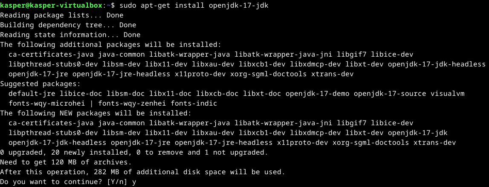

Haetaan wget komennolla GitHubista Ghidra versio 11.1.2. Tässä tapauksessa tämä versio, koska tuoreempi versio tarvitsee Java 21, mitä en ainakaan suoralla apt-get install komennolla vielä repositorystä löytänyt. Puretaan lisäksi paketti.

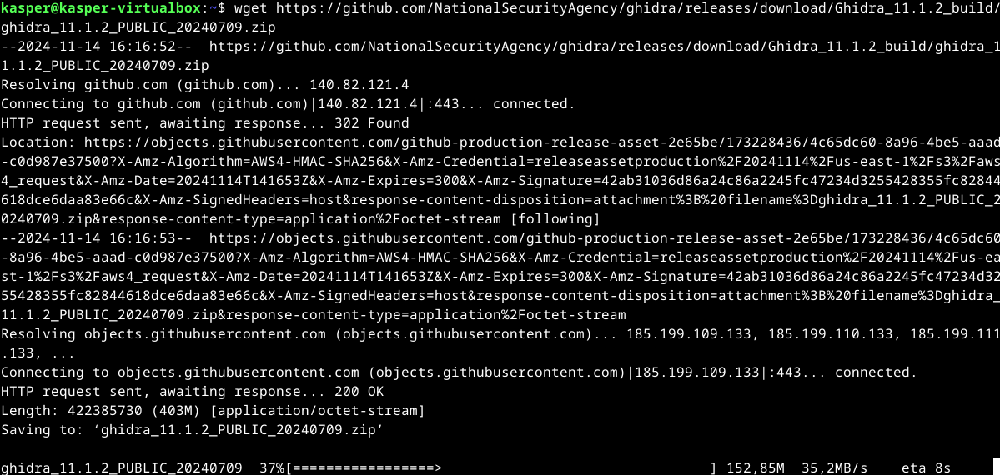
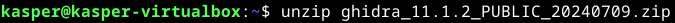

Suoritetaan Ghidra puretusta kansiosta ja varmistetaan, että se aukeaa oletetulla tavalla.

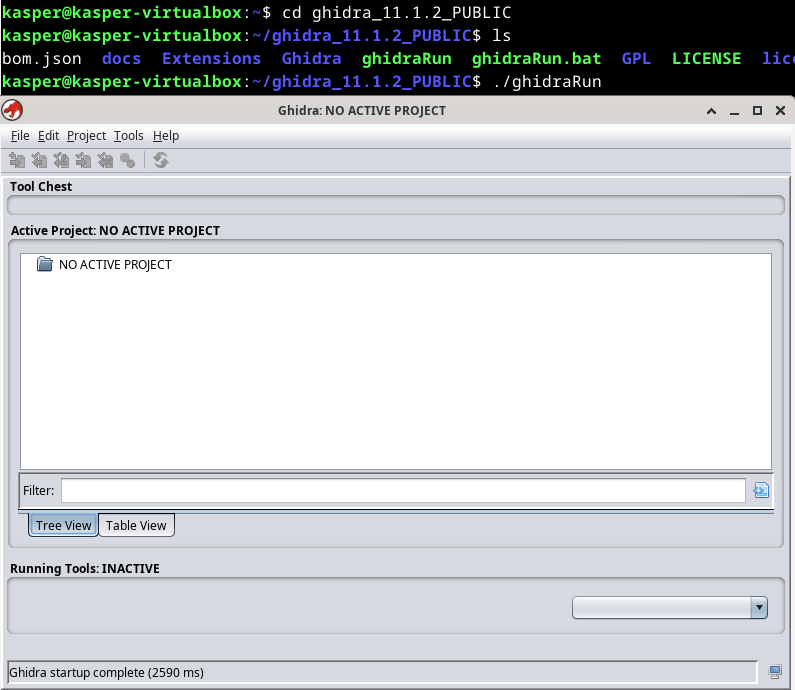

Toimiihan se!

## b) rever-C
Packd tehtävää varten Ghidra käyntiin ja luodaan sille uusi projekti.

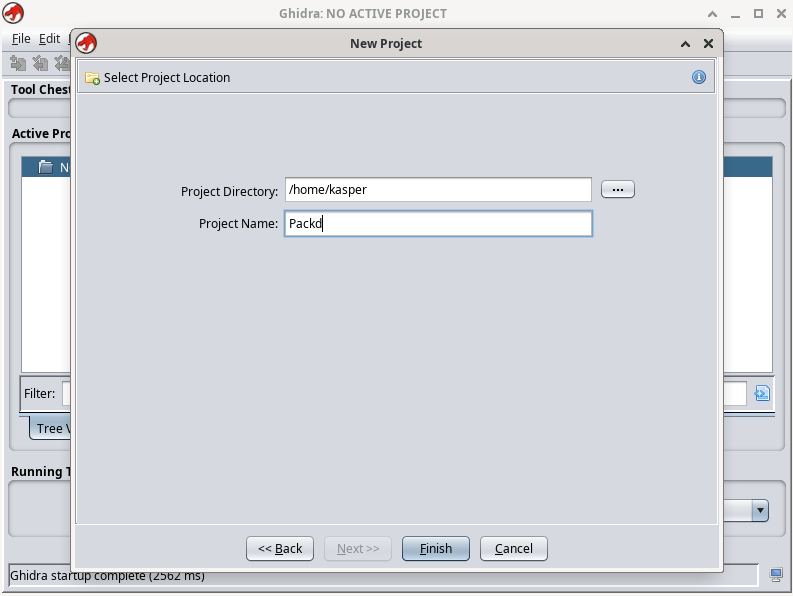

Syötetään packd ohjelma projektiin.

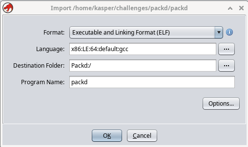

Analysoidaanko? No tietekin. Täysin default valinnoilla mennään.

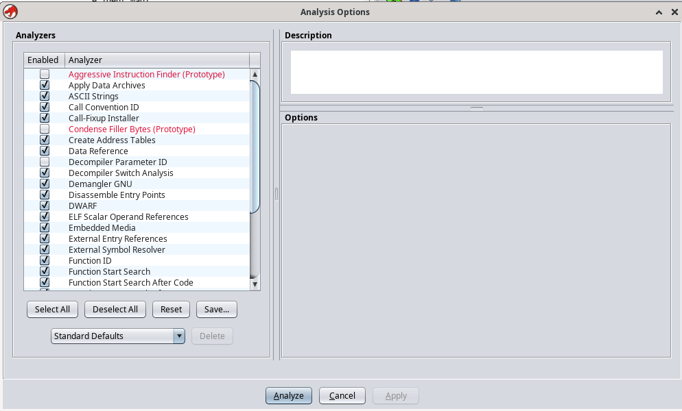

Itse lähdin etsimään main ohjelmaa aluksi suoraan Listing kohdasta, mutta nopeasti tajusin sen olevan turhan loputon heinäsuo. Selailin hieman Program Trees kohtaa, sieltäkin oli hieman hankala löytää mitään järkevää. Alempaa Symbol Tree kohdasta kuitenkin löytyi suoraan main kohta, mikä oli ilmeisestikkin tarkoitus löytää.

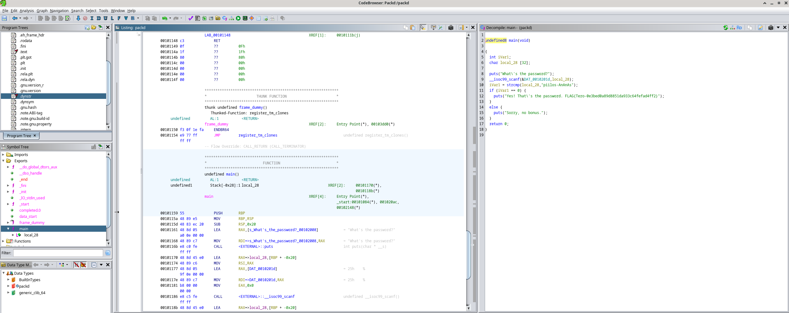

Lähdin Decompile ikkunasta miettimään ratkaisuja vajanainseen C-koodin tynkään.

Ylimmän main(void) kohdan jätin samaksi, kyseessä on pääfunktio.

**int iVar1; -> int Password**

int, eli ohjelman muuttuja. Ohjemassa viitataan siihen useampaan kertaan. Tallentaa strcmp-funktion tulosten ja varmistaa onko se käyttäjän syöte oikea salasana.

**char local_28 -> char inputPassword**

char, eli käyttäjän syöte. Siihen viitataan muutamssa eri kohdassa missä sitä verrataan esimerkiksi onko salasana == 0 ja sen perusteella annetaan oikea syöte.

Ohjelmasta löytyy lisäksi tietenkin

**strcmp**, vertailee käyttäjän syötettä oikeaan salasanaan ohjelmasta.

**puts**, joka ohjeistaa käyttäjää syöttämään salasanan ja myöhemmin tulostaa oikean tuloksen.

**scanf**, mikä lukee käyttäjän syötteen ja aloittaa vertausprosessin.

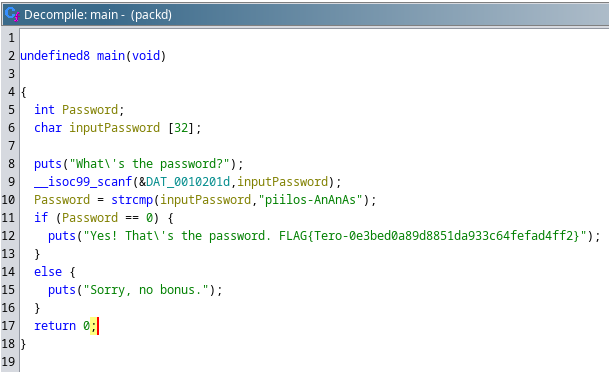

## c) Jos väärinpäin
Tehdään tehtävää varten uusi projekti ja syötetään sille passtr ohjelma.

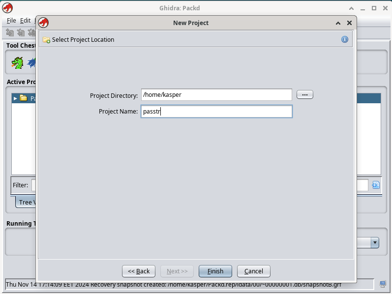
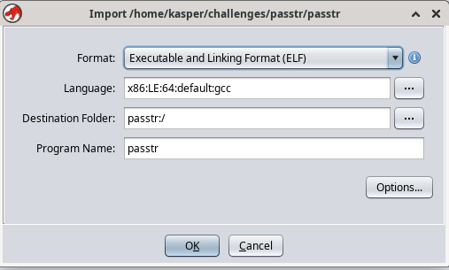

Tuli ohjelman Ghidraan syöttämisen jälkeen, että koneelta löytynyt versio olikin jo h3 tehtävissä muokattu versio. Testataan nyt vielä sen toiminta, ennen jatkamista.

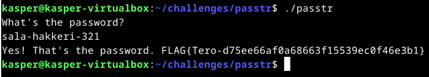

Toimiihan se, salasanalla sala-hakkeri-321 saadaan siis lippu näkyviin. Mennään sillä mielenkiinnon vuoksi toimiiko kääntäminen koodiin syöttämästäni makroista huolimatta.

Etsin jälleen Symbol Tree kohdasta main koodin ja klikkailin Decompile kohdasta if, saaden näkyviin Binääristä **JNZ** (Jump if not equal/nonzero) kohdan. Tunnilta olikin esimerkistä muistissa jo, että se vaihdetaan **JZ** (Jump if equal/zero) millä ohjelma saadaan käännettyä toimimaan toisinpäin.

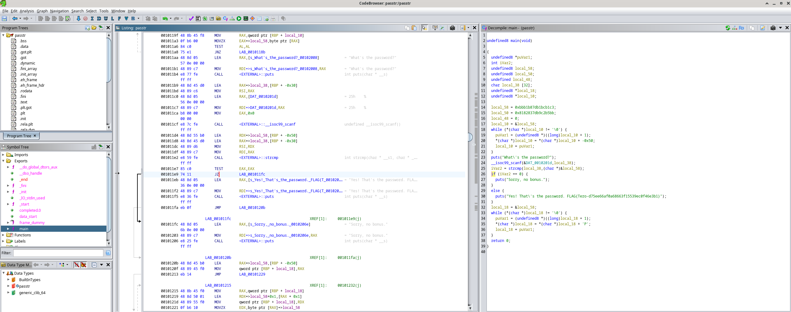

Tallennetaan ja avataan File menusta Export Program. 

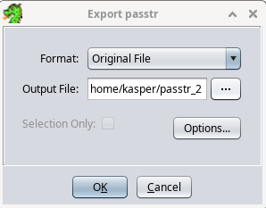

Tuore versio ohjelmasta tallennettuna nyt alkuperäiseen kansioon, mutta ei ollutkaan suoraan oikeuksia suorittaa sitä joten annetaan sille samat oikeudet kuin alkuperäisellä ohjelmalla.

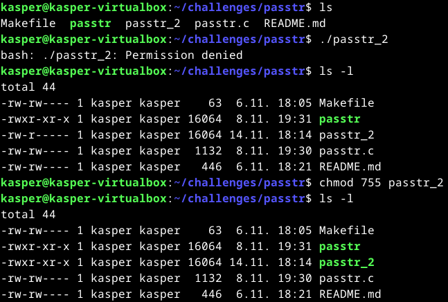

Testataan, saadaanko lippu näkyviin sala-hakkeri-321 salasanalla.

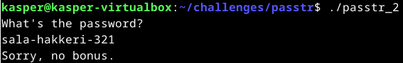

Eipä näy. Testataan sitten muutamaa eri salasanaa, saadaanko niillä näkyviin.

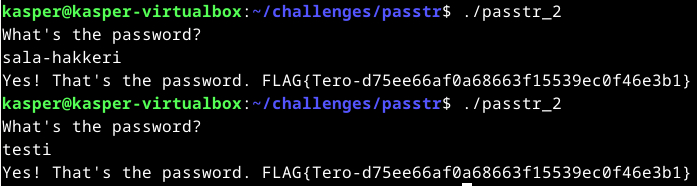

Bingo. Lippu näkyviin kahdella eri tavalla joten käänteinen syöte toimii.

## d) Nora CrackMe
Asennellaan Nora CrackMe tehtäviä varten Git, jotta saadaan helposti kloonattua koko GitHub Repositoryn sisältö suoraan koneelle.

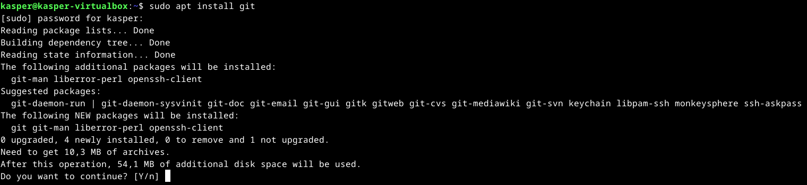

Luonnollisetsi kloonataan git käyttäen perään tarpeelliset tiedostot virtuaalikoneelle.

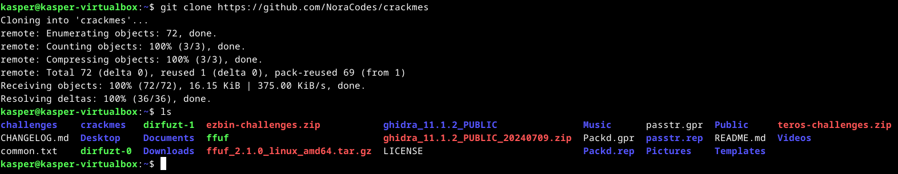

Tarkastellaan vielä, että tiedostot on käytettävissä ja README.md ohjeistusta käyttöön.

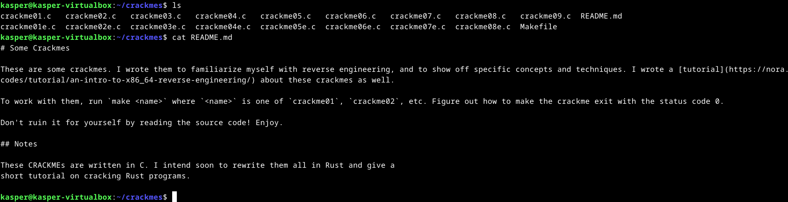

## e) Nora crackme01

## e) Nora crackme01e

## f) Nora crackme02

## g)

## h)

## i)

## Lähteet

Karvinen T. h4 Kääntöpaikka. Tero Karvisen verkkosivut. Luettavissa: https://terokarvinen.com/application-hacking/#h4-kaantopaikka Luettu: 14.11.2024

John Hammond Youtube. GHIDRA for Reverse Engineering. Katsottavissa: https://www.youtube.com/watch?v=oTD_ki86c9I Katsottu: 14.11.2024

Cplusplus.com. Variables and types. Luettavissa: https://cplusplus.com/doc/tutorial/variables/ Luettu 14.11.2024

Cplusplus.com. puts. Luettavissa: https://cplusplus.com/reference/cstdio/puts/ Luettu: 14.11.2024

Cplusplus.com. scanf. Luettavissa: https://cplusplus.com/reference/cstdio/scanf/ Luettu: 14.11.2024

Cplusplus.com. strcmp. Luettavissa: https://cplusplus.com/reference/cstring/strcmp/ Luettu: 14.11.2024

Rangeforce. Patching Binaries With Ghidra. Luettavissa: https://materials.rangeforce.com/tutorial/2020/04/12/Patching-Binaries/ Luettu: 14.11.2024

