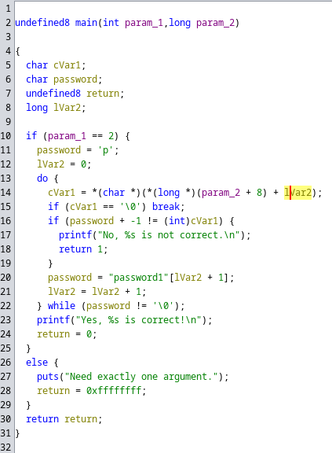

# h4 - Kääntöpaikka

## Rauta & HostOS

- Asus X570 ROG Crosshair VIII Dark Hero AM4
- AMD Ryzen 5800X3D
- G.Skill DDR4 2x16gb 3200MHz CL16
- 2x SK hynix Platinum P41 2TB PCIe NVMe Gen4
- Sapphire Radeon RX 7900 XT NITRO+ Vapor-X
- Windows 11 Home

## x) Lue/katso/kuuntele ja tiivistä

### Hammond 2022: Ghidra for Reverse Engineering (PicoCTF 2022 #42 'bbbloat')
- Videolla käydään läpi PicoCTF 'bbbloat' tehtävän käänteismallinnusta
- Ghidran asentamisen ja käyttämisen lisäksi, videolla käydään lyhyesti läpi myös strace & ltrace sekä objdump käyttöä.
- Ghidraa suorittaessa käytiin läpi, miten Ghidran Strings ikkunaa hyödynnetään binääristä tietojen löytämiseen.
- Videossa painotetaan, miten tärkeää on yrittää ymmärtää koodia ja miettiä, mitä se tekee ymmärtääksesi tehtävän ratkaisun.

## a) Asenna Ghidra.
Ghidran asentaminen Debian 12 käyntiin. Asennellaan ensin sitä varten OpenJDK (Open Java Development Kit).

Haetaan wget komennolla GitHubista Ghidra versio 11.1.2. Tässä tapauksessa tämä versio, koska tuoreempi versio tarvitsee Java 21, mitä en ainakaan suoralla apt-get install komennolla vielä repositorystä löytänyt. Puretaan lisäksi paketti.

Suoritetaan Ghidra puretusta kansiosta ja varmistetaan, että se aukeaa oletetulla tavalla.

Toimiihan se!

## b) rever-C
Packd tehtävää varten Ghidra käyntiin ja luodaan sille uusi projekti.

Syötetään packd ohjelma projektiin.

Analysoidaanko? No tietekin. Täysin default valinnoilla mennään.

Itse lähdin etsimään main ohjelmaa aluksi suoraan Listing kohdasta, mutta nopeasti tajusin sen olevan turhan loputon heinäsuo. Selailin hieman Program Trees kohtaa, sieltäkin oli hieman hankala löytää mitään järkevää. Alempaa Symbol Tree kohdasta kuitenkin löytyi suoraan main kohta, mikä oli ilmeisestikkin tarkoitus löytää.

Lähdin Decompile ikkunasta miettimään ratkaisuja vajanainseen C-koodin tynkään.

Ylimmän main(void) kohdan jätin samaksi, kyseessä on pääfunktio.

**int iVar1; -> int Password**

int, eli ohjelman muuttuja. Ohjemassa viitataan siihen useampaan kertaan. Tallentaa strcmp-funktion tulosten ja varmistaa onko se käyttäjän syöte oikea salasana.

**char local_28 -> char inputPassword**

char, eli käyttäjän syöte. Siihen viitataan muutamssa eri kohdassa missä sitä verrataan esimerkiksi onko salasana == 0 ja sen perusteella annetaan oikea syöte.

Ohjelmasta löytyy lisäksi tietenkin

**strcmp**, vertailee käyttäjän syötettä oikeaan salasanaan ohjelmasta.

**puts**, joka ohjeistaa käyttäjää syöttämään salasanan ja myöhemmin tulostaa oikean tuloksen.

**scanf**, mikä lukee käyttäjän syötteen ja aloittaa vertausprosessin.

## c) Jos väärinpäin
Tehdään tehtävää varten uusi projekti ja syötetään sille passtr ohjelma.

Tuli ohjelman Ghidraan syöttämisen jälkeen, että koneelta löytynyt versio olikin jo h3 tehtävissä muokattu versio. Testataan nyt vielä sen toiminta, ennen jatkamista.

Toimiihan se, salasanalla sala-hakkeri-321 saadaan siis lippu näkyviin. Mennään sillä mielenkiinnon vuoksi toimiiko kääntäminen koodiin syöttämästäni makroista huolimatta.

Etsin jälleen Symbol Tree kohdasta main koodin ja klikkailin Decompile kohdasta if, saaden näkyviin Binääristä **JNZ** (Jump if not equal/nonzero) kohdan. Tunnilta olikin esimerkistä muistissa jo, että se vaihdetaan **JZ** (Jump if equal/zero) millä ohjelma saadaan käännettyä toimimaan toisinpäin.

Tallennetaan ja avataan File menusta Export Program. 

Tuore versio ohjelmasta tallennettuna nyt alkuperäiseen kansioon, mutta ei ollutkaan suoraan oikeuksia suorittaa sitä joten annetaan sille samat oikeudet kuin alkuperäisellä ohjelmalla.

Testataan, saadaanko lippu näkyviin sala-hakkeri-321 salasanalla.

Eipä näy. Testataan sitten muutamaa eri salasanaa, saadaanko niillä näkyviin.

Bingo. Lippu näkyviin kahdella eri tavalla joten käänteinen syöte toimii.

## d) Nora CrackMe
Asennellaan Nora CrackMe tehtäviä varten Git, jotta saadaan helposti kloonattua koko GitHub Repositoryn sisältö suoraan koneelle.

Luonnollisetsi kloonataan repository git käyttäen, että saadaan tarpeelliset tiedostot virtuaalikoneelle.

Tarkastellaan vielä, että tiedostot on käytettävissä ja README.md ohjeistusta käyttöön.

## e) Nora crackme01
Tehdään make komennolla tehtävää varten koodista ajettava ohjelma crackme01.

SUoritettava sovellus tehty, joten luonnollisesti ajetaan se alkuun ja katsotaan mitä tapahtuu.

Okei. Tarvitsee jonkun lauseen ohjelman suoritteeseen. Ehkä tässä haetaan jotai salasanan tapaista?

Selvästikkin. Lähdin edellisten tuntien ja tehtävien opeilla tarkastelemaan ohjelmaa Strings komennolla.

password1 pistää heti silmään tulosteesta. Testataanpa sitä käytäntöön.

Bingo. Tehtävän "lippu" löydetty.

## e) Nora crackme01e
Tehdään jälleen make komennola tehtävää varten koodista ajettava ohjelma crackme01e.

Testataan toimivuus.

Okei. Sama kuvio kun edellisessä, salasanaa haetaan. Suoritellaan jälleen Strings komento ohjelmalle.

slm!paas.k, siinähän se salasana olisi jälleen tarjolla. Mitään sen kummempaa salausta tiedostolla ei näytä olevan, koska kaikki tiedot on selkeästi lauseissa luettavissa. Testataan.

Mitä ihmettä, ei toimikkaan. Erityinen virhe muutenkin, mutta alkuun ehkä vähän sivutin vielä itse bash virhettä. Tutkaillaanpa vielä eri tavalla ohjelmaa.

Cat komentokaan ei oikeastaan kerro mitään uutta. Ihan ei aukea, miksi salasana ei toimi. Tuumailin tätä pidemmän tovin, mutta en keksinyt ja pidinkin hieman taukoa välissä. 

Rupesin tauon jälkeen hieman pähkäilemään tuota virhettä, kun salasanan syöttää ja googlailin asiaa. Tuli vastaan satunnainen Serverfaultin [keskusteluun](https://serverfault.com/questions/413582/how-to-escape-in-password), missä ! salasanassa aiheuttaa kyseisen virheen käyttäjälle. Mikä ratkaisuksi? Kommenteista löytyy vihje miten syöttämällä salasana '' sisään voidaan ohittaa kyseinen bash virhe. Testiin.

Bingo. Tämähän se ratkaisu ongelmaan oli ja nyt lippu löydettynä.

## f) Nora crackme02
Tehdään tehtävää varten jälleen itse ohjelma koodista.

Testataan, miten ohjelma toimii ennen sen tarkempaa tutkimista.

Vastaa selvästi aikasempia tehtävien ohjelmia. Tutkitaan alkuun Strings komennolla.

Salasanoja näkyvissä. Testataan kaksi näkyvillä olevaa.

Mielenkiintoista, eihän ne toimi. Tiedossa tietenkin olikin tehtävänannosta, että ohjelmaan on tarkoitus soveltaa käänteismallinnusta. Luodaanpa siis Ghidraan oma projekti ja syötetään ohjelma sinne tarkempaa tarkastelua varten.

Ohjelma auki Ghidrassa ja main pääfunktio löydetty koodin tarkempaa tarkastelua varten.

Lähdin tarkastelemaan ja muokkaamaan koodia omien taitojen pohjalta. 

Alusta meiltä löytyy tietenkin **main**, eli ohjelman pääfunktio ja sille on asetettu kaksi muuttujaa **int** & **long**.

Ohjelmasta löytyy useampi **char**, eli käyttäjän syöte. Mietin, että toinen niistä on ainakin käyttäjän syöttämän salasana eli password.

Koodissa selvästi verrataan ja lasketaan käyttäjän syötettä laskutoimituksella, sen verran saan irti. En kuitenkaan keksi, mitä param_1 ja param_2 esimerkiksi olisi.

Jäin miettimään koodin loppua ja etenkin **uvar3 = 0xffffffff**. Koodissa viitataan useaan kertaan käytännössä loppukohdassa uvar3 syötteeseen, joten voisiko se olla joku tuloste? Googlettelin ja löysin, että **0xffffffff** on käännettynä -1. Nimesin siispä uvar3 **Return**.

Tähän loppuikin oikeastaan oma mietintä ja jätin asiaa hieman hautumaan, jatkaen tehtävää seuraavana päivänä.

Seuraavan päivän tullessa ja tehtävää jatkaessa, ei koodille sen enempää tuntunut olevan annettavaa. Kiinnosti kuitenkin tehtävän ratkaisu, joten turvauduin tehtävän [Tutorialiin](https://nora.codes/tutorial/an-intro-to-x86_64-reverse-engineering/)

Sieltä löytyikin paljon kattavasti tietoa käänteismallinnuksesta. Pakko myöntää, että edes tutorialin kanssa koodin kääntäminen ja ymmärtäminen oli todella haastavaa. Käytännössä kuitenkin, ohjelman koodin idea on kääntää "password1" salasana ASCII-muunnettuun versioon ja sen jälkeen vielä vähentää jokaisesta merkistä 1.

**int argc** ARGument Count. Kokonaisluku, joka kertoo komentoriviparametrien lukumäärän.
**long argv** ARGument Vector. Taulukko osoittimista, jotka viittaa komentorivillä annettuihin parametreihin.

**char password** käyttäjän syöte
**undefined8 return** odotettu ASCII muunnettu salasana
**long index** ohjelman palautusarvo
**char comparison** laskuri/vertaaja merkkijonolle

Myönnettäköön, ettei vieläkään täyttä käsitystä onko muutokset edes lähellä. Nämä kuitenkin tuntui itselle loogisilta tarkastellessa tutoriaalia. Sielläkään ei täyttä koodia paljasteta.

Ohjelma kääntää password1 salasanan ASCII-muunnettuun versioo, minkä syötteeksi tulee **"o`rrvnqc0"**. Testataan tätä käytäntöön.

Toimiihan se. Syötteeseen pitää lisätä kenoviiva, koska ilman sitä shell yrittäisi tulkita ` jälkeistä osana omaa syntaksia. Tutoriaalista löytyi myös virhe koodissa, mikä mahdollistaa "" käyttämisen salasana.

## Lähteet

Karvinen T. h4 Kääntöpaikka. Tero Karvisen verkkosivut. Luettavissa: https://terokarvinen.com/application-hacking/#h4-kaantopaikka Luettu: 14.11.2024

John Hammond Youtube. GHIDRA for Reverse Engineering. Katsottavissa: https://www.youtube.com/watch?v=oTD_ki86c9I Katsottu: 14.11.2024

Cplusplus.com. Variables and types. Luettavissa: https://cplusplus.com/doc/tutorial/variables/ Luettu 14.11.2024

Cplusplus.com. puts. Luettavissa: https://cplusplus.com/reference/cstdio/puts/ Luettu: 14.11.2024

Cplusplus.com. scanf. Luettavissa: https://cplusplus.com/reference/cstdio/scanf/ Luettu: 14.11.2024

Cplusplus.com. strcmp. Luettavissa: https://cplusplus.com/reference/cstring/strcmp/ Luettu: 14.11.2024

Rangeforce. Patching Binaries With Ghidra. Luettavissa: https://materials.rangeforce.com/tutorial/2020/04/12/Patching-Binaries/ Luettu: 14.11.2024

NoraCodes GitHub. Some Crackmes. Luettavissa: https://github.com/NoraCodes/crackmes Luettu 14.11.2024

Serverfault. How to escape ! in password?. Luettavissa: https://serverfault.com/questions/413582/how-to-escape-in-password Luettu: 14.11.2024

StackOverflow. Why unsigned int 0xFFFFFFFF is equal to int -1? Luettavissa: https://stackoverflow.com/questions/1863153/why-unsigned-int-0xffffffff-is-equal-to-int-1 Luettu 14.11.2024

Leonora Tindall. An Intro to x86_64 Reverse Engineering. Luettavissa: https://nora.codes/tutorial/an-intro-to-x86_64-reverse-engineering/ Luettu 15.11.2024

