# h5 - Se elää!

## Rauta & HostOS

- Asus X570 ROG Crosshair VIII Dark Hero AM4
- AMD Ryzen 5800X3D
- G.Skill DDR4 2x16gb 3200MHz CL16
- 2x SK hynix Platinum P41 2TB PCIe NVMe Gen4
- Sapphire Radeon RX 7900 XT NITRO+ Vapor-X
- Windows 11 Home

## a) Lab1
Ennen tehtävän aloittamista, asennetaan GNU Debugger.

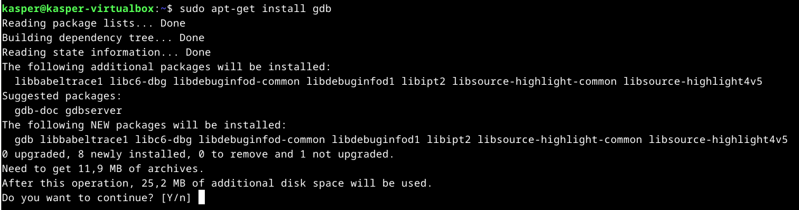

Testailin vielä, että mitä itse ohjelma suorittaessa tekee ennen GNU Debuggerilla tarkastelua.

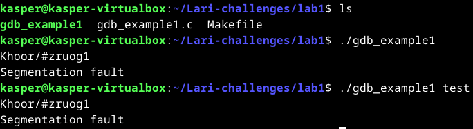

Tulostaa erikoisen kirjainsarjan ja Segmentation Faultin toiselle riville. Tarkastellaan seuraavaksi GNU Debuggerissa. **List** komennolla lähdekoodia tarkemmin näkyviin.

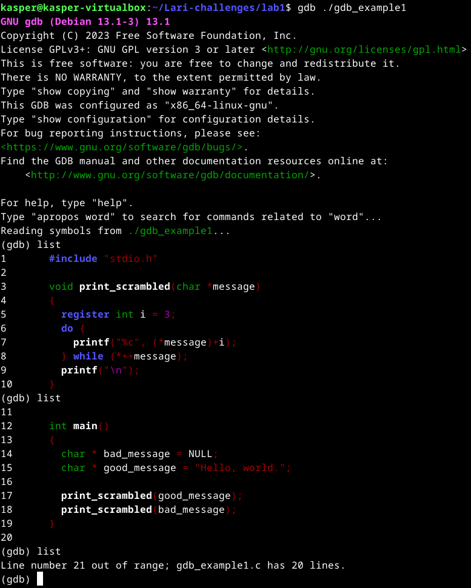

Ajetaan ohjelmaa **Run** komennolla.

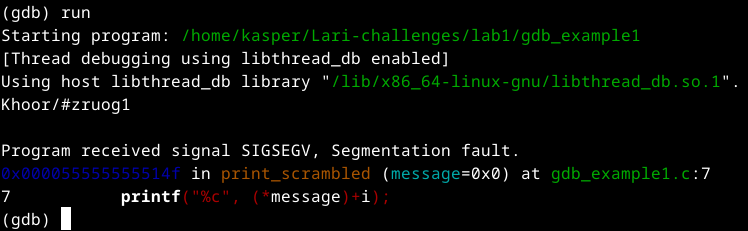

Rivillä 7 tulee käsitykseni mukaan Segmentation Fault. Tarkastellaan sitä hieman tarkemmin asettamalla siihen **Breakpoint**.

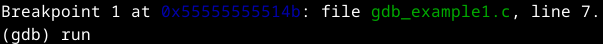

Uudestaan ohjelmaa ajaessa, huomaan sen miten **"Hello, World."** tekstistä poistuu hiljalleen kirjaimia ja lopulta antaa tulosteen **"Khoor/#zruog1"**. Tarkemmin tarkastellessa molemmissa sama määrä merkkejä, eli ohjelma siis kääntää kirjain kerrallaan alkuperäisen tekstin.

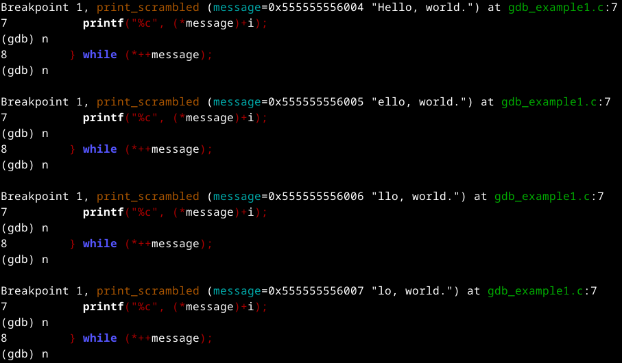

Huomasin myös, miten Segmentation Fault tulee heti kun viimeinen kirjain on käännetty ja tuloste annettu käännökselle.

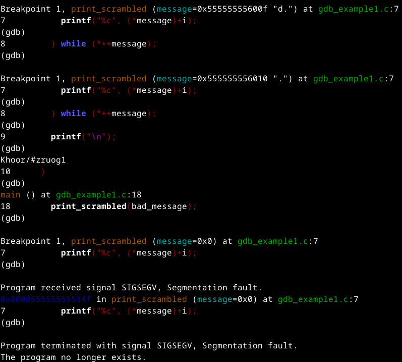

Tarkastellaanpas korjausta avaamalla alkuperäinen lähdekoodi Microssa ja korjataan viallinen koodi.

Ohjelman tarkoitushan on ilmeisesti siis kääntää teksti "Hello, World." 

**void print_scrambled(char *message)*** Funktio osoitin, eli merkkijono

**register int i = 3;** - Tämän perusteella käytetään ilemisesti ASCII-taulukkoa

**printf("%c", (*message)+i);*** - Tässä haetaan kirjain ja lisätään siihen i taulukossa 3 merkkiä eteepäin vastaava merkki

**while (*++message);*** Siiryminen seuraavaan merkkiin

**printf("\n");** Lopputuloksen tulostus

**int main()
{
  char * bad_message = NULL;
  char * good_message = "Hello, world.";** Muuttujat bad_message & good_message.

**print_scrambled(good_message);** Funktio vastaanottaa osoittimen good_message ja kääntää sen ASCII-taulukon mukaan.

**print_scrambled(bad_message);** Funktiokutsu, mikä on virheellinen, koska NULL viittaa asiaan mikä ei ole kelvollinen ja siitä tulee Segmentation Fault.

No, miten ongelma korjataan? Lisätään koodiin tarkistus, mikä kertoo ohjelmalle olevan tekemättä mitään jos osoitin on NULL.

    if (message == NULL) {
        return;

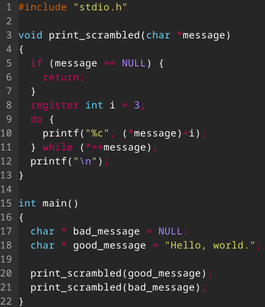

Testataan vielä, onko ohjelmasta kadonnut segmentointi virhe.

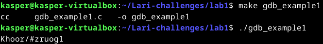

## b) Lab2
Bah, Lab2. Tehtävä, joka osoittautui tällä kertaa turhankin vaikeaksi itselle.

Yritin alkuun tarkastella list ja sen jälkeen GDB ehdoittamalla file komennolla.

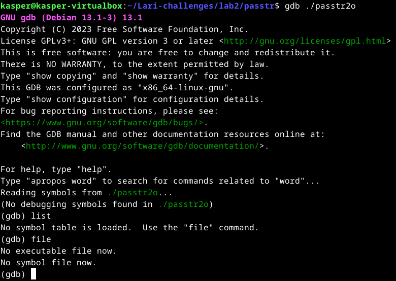

Ei onnistunut. Kokeillaanpa suorittaa **break main** ja ajaa ohjelmaa **run** komennolla niin nähdään mitä se tarkalleen tekee.

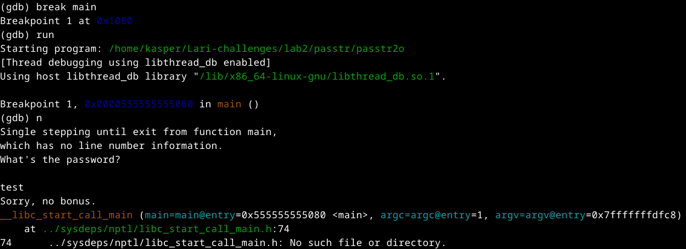

Okei, salasanaa haetaan luonnollisesti. **Disassemble** komennolla haetaan main funktiosta näkyviin assemblerin näkymä.

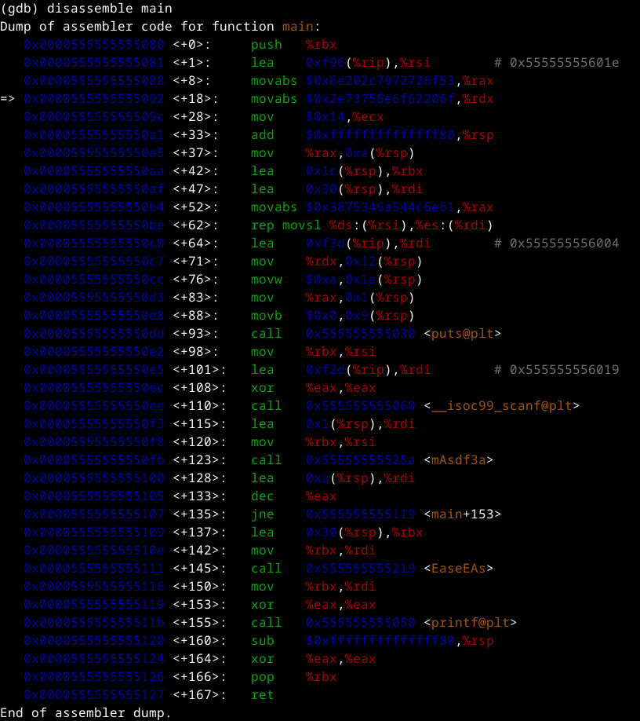

Tässä kohtaa iski jo ensimmäistä kertaa sormi suuhun. Kyselinkin vähän ChatGPT apuja ja sieltä ilmeni, että **mAsdf3a** kohtaan voisi olla hyvä asettaa toinen breakpoint. Näin liikkeelle ja lähdin tarkastelemaan sen rekisteritietoja tarkemmin.

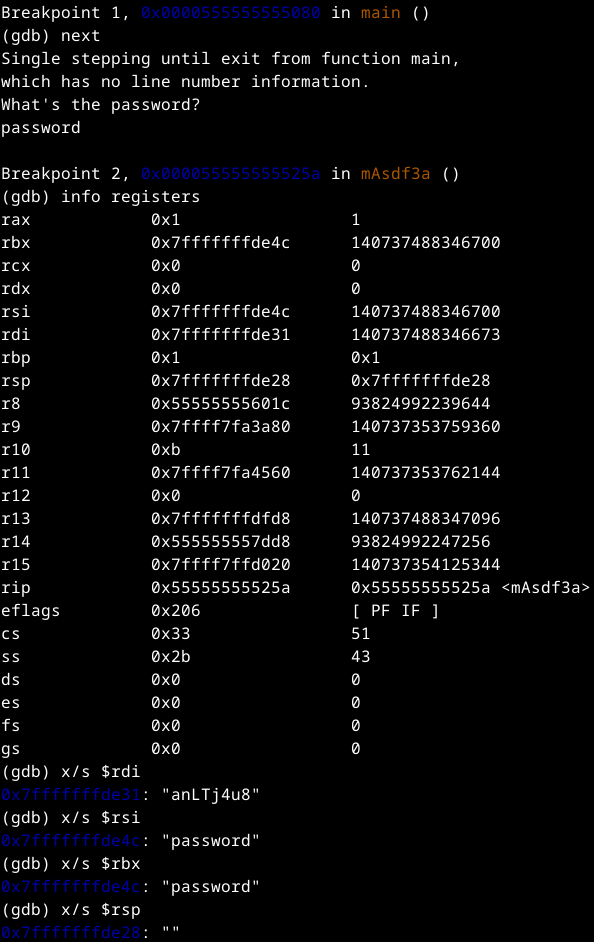

Sieltä ilmeni luonnollisesti omasyötteenä password, mutta **anLTJ4u8** pisti erityisesti silmään. Voisiko se olla ohjelman salasana?

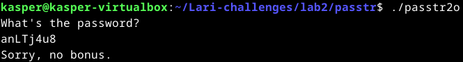

No juu ei. Taas olin hieman pattitilanteessa. Yritin selailla eri lähteitä, kävin läpi Larin tunnilla käyttämää esitystä ja keskustelin ChatGPT kanssa. Lähdin pilkkomaan GDB jaetussa näkymässä Assembleria kohta kerrallaan.

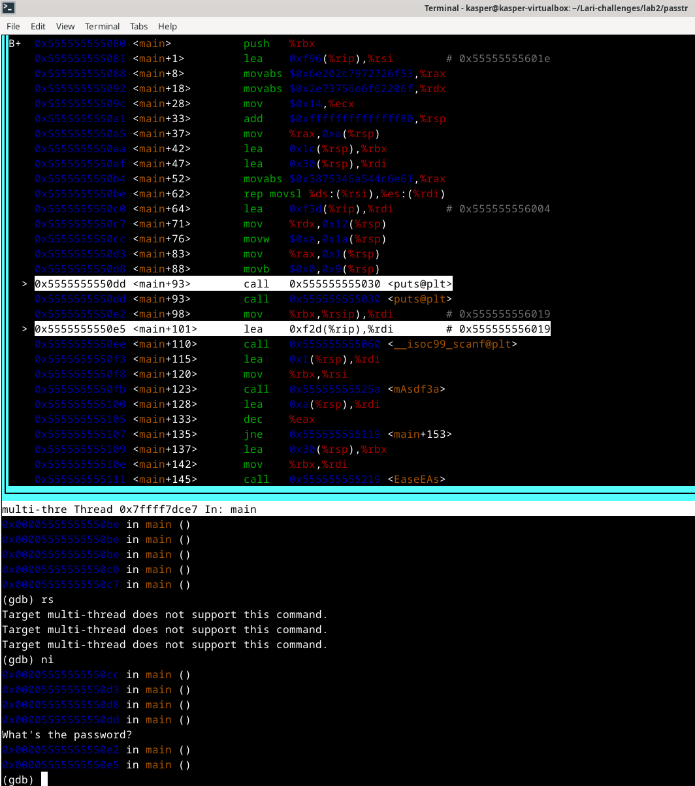

Yritin kohdissa tarkastella eri kohtia **x/s** komennolla, mutta ei se juuri tuottanut mitään sen uudempaa tulosta mitä aikasemmin.

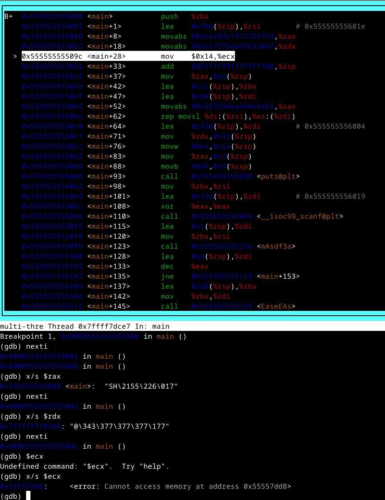
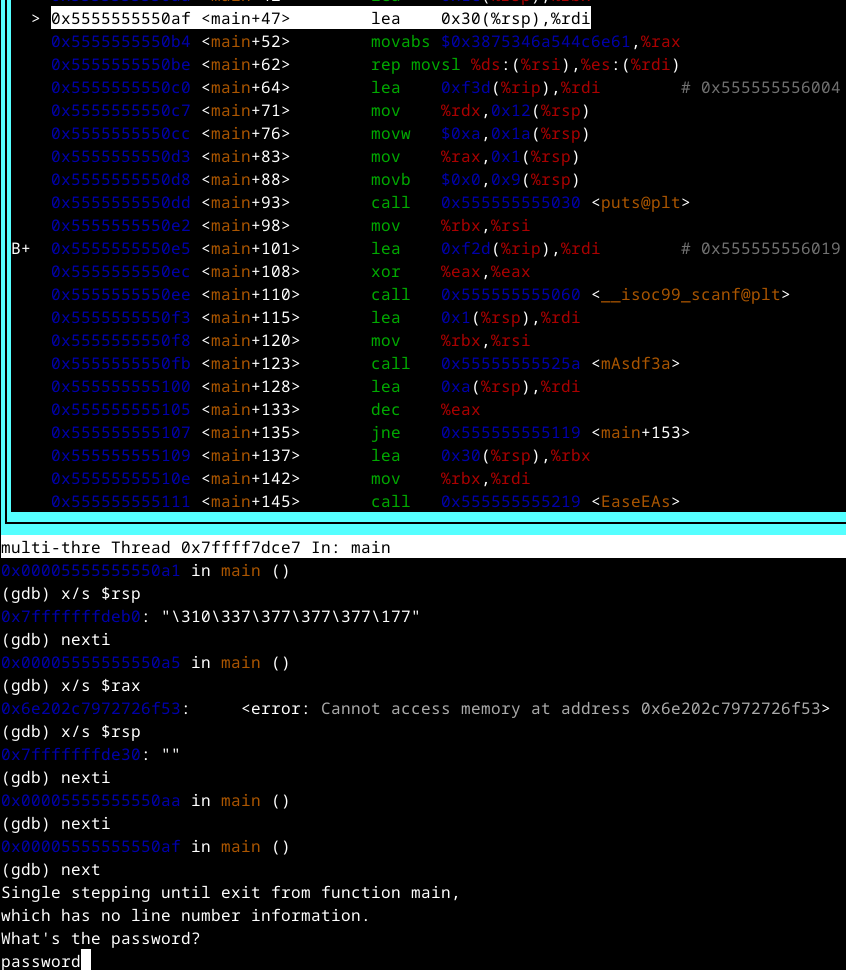

Pilkoin myös mAsdf3a kohtaa tarkemmin, mutta ei sieltäkään mitään uutta löytynyt.

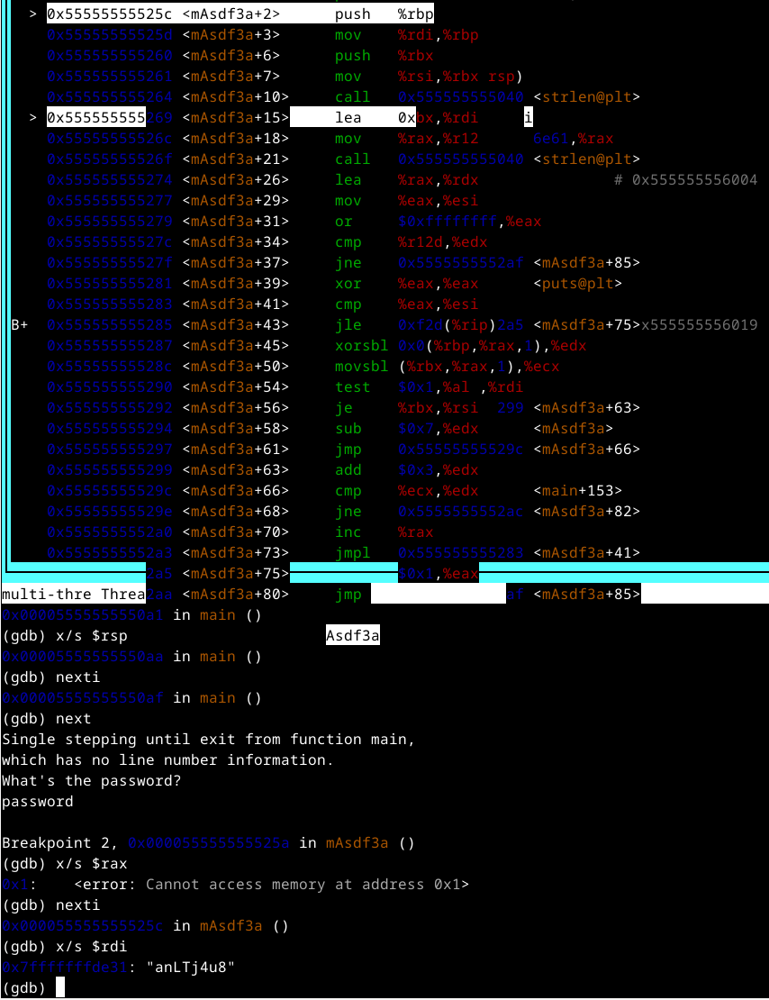
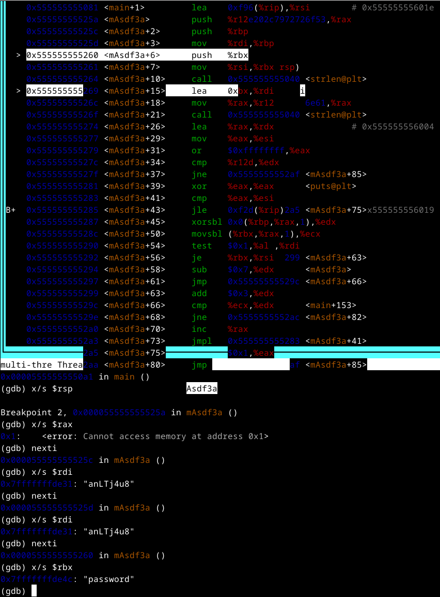
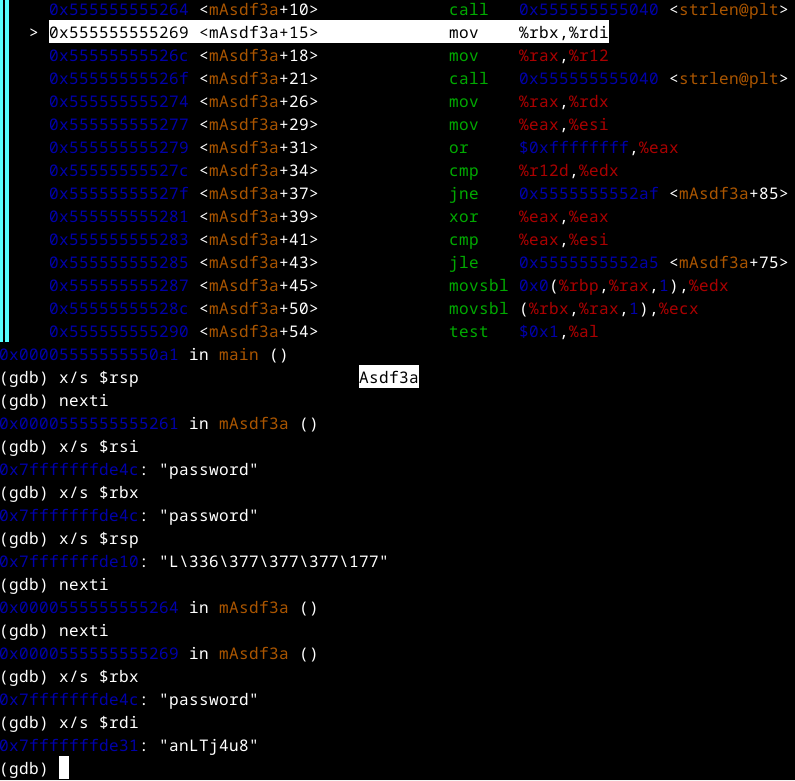

Täysin patti tilanteessa mitä pitäisi tehdä. Katselin videoita, selailin eri ratkaisuja, mutta en löytänyt mitään fiksua. Yritin muistella mitä tunnilla käytiin läpi ja yritin vain kokeilla eri juttuja GNU Debuggerissa tuloksetta.

Tähän tuli käytettyä varmaan toista kymmentä tuntia aikaa GNU Debuggerissa, laskematta edes mukaan aikaa mitä käytin videoiden katsomiseen ja artikkeleiden lueskeluun. Mikään ei vaan tuntunut toimivan. Pakko oli lopulta vain tyytyä kohtaloon ja hyväksyä tällä kertaa tappio.

**LUOVUTUS** - Jätetään tehtävän ratkaisu myöhempään ajankohtaan, kun saan lisää oppeja tekemiseen.

## b) Lab3
Availin tehtävän nopeasti, mutta lähes kaikki kurssille käytetty opiskeluaika oli mennyt Lab2 parissa, joten tämäkin jäi myöhempään ajankohtaan.

## Lähteet

Karvinen T. h5 Se elää! Tero Karvisen Verkkosivut. Luettavissa: https://terokarvinen.com/application-hacking/#h5-se-elaa Luettu 23.11.2024

GeeksForGeeks. Segmentation Fault in C++. Luettavissa: https://www.geeksforgeeks.org/segmentation-fault-c-cpp/ Luettu 23.11.2024

Sovellusten hakkerointi ja haavoittuvuudet - ICI012AS3A-3001 Moodle. 01-GDB.pdf. Luettu 23.11.2024

Darkdust. GBD cheatsheet. Luettavissa: https://darkdust.net/files/GDB%20Cheat%20Sheet.pdf Luettu: 23.11.2024

RedHat. The GDB developer's GNU Debugger tutorial, Part 1: Getting started with the debugger. Luettavissa: https://developers.redhat.com/articles/the-gdb-developers-gnu-debugger-tutorial-part-1-getting-started-with-the-debugger# Luettu: 23.11.2024

Tehtävä b) sisällössä yritetty hyödyntää ChatGPT-4 -kielimallia.

