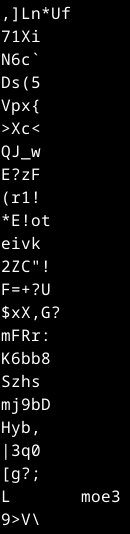
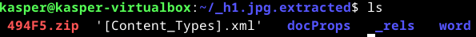
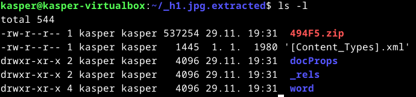
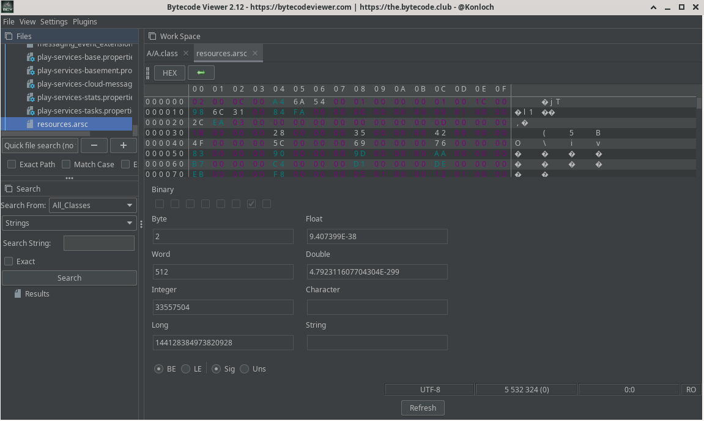

# h6 - Sulaa hulluutta

## Rauta & HostOS

- Asus X570 ROG Crosshair VIII Dark Hero AM4
- AMD Ryzen 5800X3D
- G.Skill DDR4 2x16gb 3200MHz CL16
- 2x SK hynix Platinum P41 2TB PCIe NVMe Gen4
- Sapphire Radeon RX 7900 XT NITRO+ Vapor-X
- Windows 11 Home 24H2

## a) Tutki tiedostoa h1.jpg jo opituilla työkaluilla.
Tehtävän aloittamista varten oli luonnollsiesti ladattava h1.jpg, mitä tutkia. Käytin Teron sivuille wget komentoa hakeakseni sen.

Päätin lähteä tutkimaan **file** komennolla, mutta mitään erityistä silmään pistävää en tästä löytänyt.

Tarkastellaan hieman esimerkiksi tiedoston kokoa **ls -l** komennolla

Seuraavaksi ajattelin, että kokeilen **Strings** komentoa kuvalle.

Syöte oli niin pitkä, että en sitä kokonaan edes tähän viitsinyt sisällyttää. Mitään relevanttia en löytänyt, epämääräistä tekstisarjaa. Siirryinkin näin ollen seuraavan tehtävän pariin, koska en enää keksinyt mitään lisättävää.

## b) Tutki tiedostoa h1.jpg binwalk:lla
Piti hieman perehtyä, miten binwalk asennetaa. Näytti kuitenkin löytyvän suoraan Debianin repositorystä.

**Binwalk** komennolla pääsi tarkastelemaan, mitä eri lisäkomennot perään tekevät.

Ajoin kuitenkin kuvan suoraan pelkällä **Binwalk h1.jpg** komennolla. 

Tuosta pisti heti silmään se, miten h1.jpg on ilmeisesti pakattuja tietoja? Binwalkin ohjeista löyty erilliset ohjeet Extraction Optionseille.

Ajetaan näin ollen **binwalk -e** komennolla, ja katsotaan mitä saadaan aikaan.

Uusi kansio rakennettuna, perehdytäänpä tarkemmin sisältöön!

Yllätti, miten monta eri kansiota ja tiedostoa ohjelma purki kuvasta! 494F5.zip tiedosto pisti ainakin heti silmään, mutta ajattelin tutkia hieman muita kansioita ensin.

Näissä kansioissa ei nyt mitään erityisen silmään pistävää, joten tutkitaan vielä hieman tarkemmin .zip tiedostoa mikä pisti alunperin silmään.

Tutkin alkuun kansioiden ja tiedostojen kokoja. Mitäpä jos yrittäisi purkaa unzipillä 494F5.zip tiedoston.

Mielenkiintoista, ei onnistu lainkaan. Mitä **file** komento näyttää.

Microsoft Word 2007+? Okei. Ei nyt älyttömästi apua, siirryin tutkimaan hieman muita kansioita ja niiden tiedostoja.

Näistä .xml tiedostoista ei mitään erityistä pistä omaan silmään. Ajattelin kuitenkin vielä kokeilla cat komentoa ja lukea mitä ne sisältää.

Ehkä päälimmäisenä pisti silmään, että sieltä löytyi esimerkiksi opettajan "Lari Iso-Anttila" nimi, mutta muuten ei mitään silmään pistävää. Entäpä **Strings** komento?

Ei mitään uutta. Tutkitaan hieman muita kansioita ja tiedostoja vielä.

Ei mitään uutta silmään pistävää. Perehdyin vielä binwalk komentoihin ja yritin ajaa esimerkisi **binwalk -A** mikä tutkii tiedostosta "Scan target file(s) for common executable opcode signatures"

Ei tuloksia. Entä **binwalk -M**, millä tutkitaan tiedoston purettuja tiedostoja rekursiivisesti.

Ei vieläkään mitään kovin ihmeellistä omaan silmään. Viimeisimpänä tarkastelin vielä tunnillakin tutkittua Entropyä **binwalk -E** komennolla

Tapahtuuhan siinä asioita, mutta ei tämä avaa itselleni tapahtumia yhtään tarkemmin. Mitään muuta tutkittavaa en Biwalkilla enää keksinyt, joten kohti seuraavaa tehtävää.

## c) FOSS (Free Android OpenSource)
Valitsin FOSS GitHubista Bitwarden sovelluksen, koska sitä tulee itsekkin käytettyä aktiivisesti niin ajattelin sen olevan mielenkiintoinen kohde tutkia. Haetaan sen .apk wget komennolla GitHubista.

### ZIP
Alkuun purin ladatun .apk sen unzipillä.

Perehdytäänpä tarkemmin, mitä sieltä löytyy.

Melkoinen määrä tiedostoja ja kansioita.

Perehdyin hieman kansioiden sisältöihin, mutta en ollut varma mitä muuta ZIP kohdassa olisi pitänyt suorittaa, joten siirryin seuraaviin ohjelmiin.

### JADX
Latasin JADX ohjelman wgetillä GitHubista, sieltä löytyi myös hyvät ohjeet miten ohjelma suoritetaan.

Puretaan ladattu paketti.

Ohjeistuksessa oli vaihtoehto ajaa joko terminalissa tai gui versiona, ajattelin tällä kertaa mennä gui versiolla joten avataan se.

Tadaa, ohjelma käynnistyy! Syötetään sille ohjeen mukaan Open File kohdasta ladattu .apk

.apk alta löytyy muutamia kansiorakenteita ja polkuja, tutkitaan sisältöä ohjelmalla hieman tarkemmin.

Resources alta löytyy ainakin vaikka mitä tutkittavaa. Availin hieman eri kohtia ja sieltä löytyi tuloksia binääristä itse koodiin.

Siinäpä se, siirrytään seuraavaan ohjelmaan.

### Bytecode Viewer
Bytecode Viewerin hain vastaavasti wget komennolla GitHubista.

GitHub ohjeistukseta löytyi ohje, miten ladattu ohjelma suoritetaan. Sitä ei tarvinnut purkaa ollenkaan, vaan .jar tiedosto ajetaan suoraan Javalla **Java -jar** komennoola

Toimiihan se! Tiputetaan kansiosta sille APK, kuten ohjelma pyytää.

Tutkitaan, miltä tällä ohjelmalla eri sisältö näyttää.

Melko samalta se näyttää. Itse ehkä pidin JADX mielyttävämpänä käyttää. Yritin skaalata Bytecode Vieweriä isommaksi, mutta se tuntui jotenkin tunkkaisen pieneltä ja ahtaalta.

## Lähteet

Karvinen T. h6 Sulaa hulluutta. Tero Karvisen Verkkosivut. Luettavissa: https://terokarvinen.com/application-hacking/#h6-sulaa-hulluutta Luettu: 29.11.2024

Kali.org Tool Documentation. Binwalk Usage Example. Luettavissa: https://www.kali.org/tools/binwalk/ Luettu: 29.11.2024

Android FOSS GitHub. Luettavissa: https://github.com/offa/android-foss Luettu: 29.11.2024

Bitwarden GitHub. Luettavissa: https://github.com/bitwarden/android Luettu: 29.11.2024

JADX GitHub. Luettavissa: https://github.com/skylot/jadx Luettu: 29.11.2024

Bytecode Viewer. Luettavissa: https://github.com/Konloch/bytecode-viewer/ Luettu: 29.11.2024
