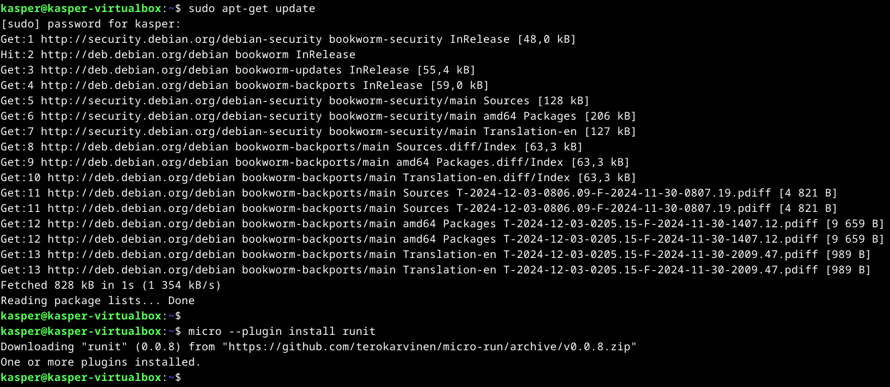
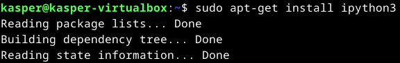
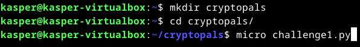
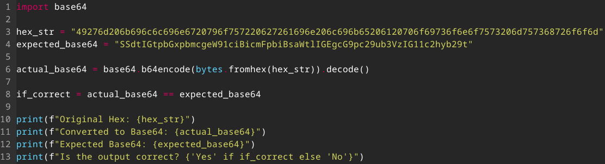
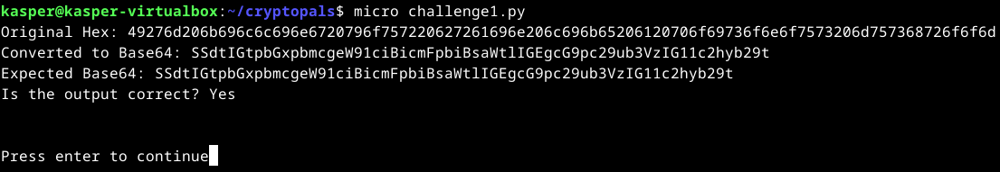
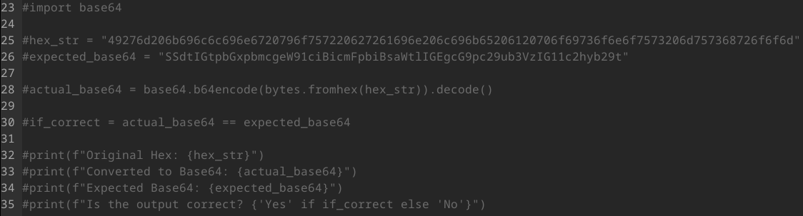
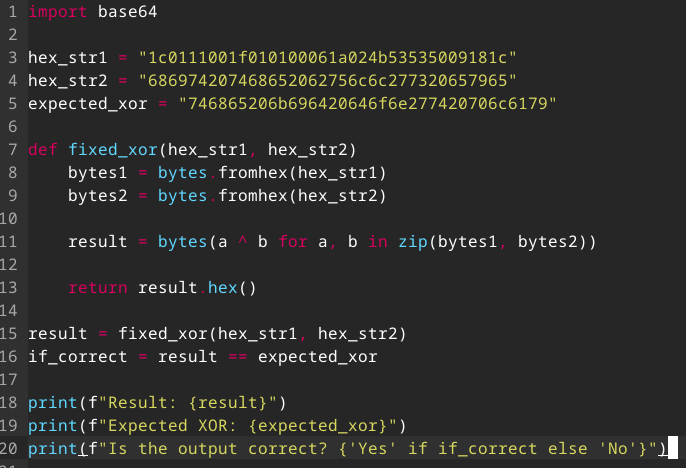
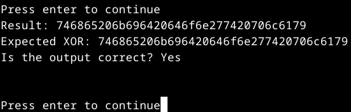

# h6 - Uhagre2

## Rauta & HostOS

- Asus X570 ROG Crosshair VIII Dark Hero AM4
- AMD Ryzen 5800X3D
- G.Skill DDR4 2x16gb 3200MHz CL16
- 2x SK hynix Platinum P41 2TB PCIe NVMe Gen4
- Sapphire Radeon RX 7900 XT NITRO+ Vapor-X
- Windows 11 Home

## x) Lue/katso/kuuntele ja tiivistä

### Schneier 2015: Applied Cryptography, 20ed: Chapter 1: Foundations
**Terminology**: Käsitellään kryptografian peruskäsitteitä ja avataan sitä, mitä kyrptografialla / analyysillä tarkoitetaan. Löytyy esinlaisia peruskäsitteitä, kuten salaukset, avaimet ja niihin liittyvät protokollat. Pieni kattaus salauksen historiaa löytyy myös.

**Simple XOR**: Kohdassa käsitellään sitä, miten XOR on hyvin yksinkertainen, mutta tehokais salausmenetelmä ja kyrptografiassa usein käytetään XOR:ia salauksen perustana. Helppo ja nopea totutettaa. 

**Large Numbers**: Large Numbers, eli suurten kukujen merkitys salauksessa. Erityisen tärkeä esimerkiksi avainten salauksessa. Korostetaan erityisesti sitä, että suuret luvut ovat vaikeita laskennallisesti, joten sen takia ne on hyvä perusta kryptografiassa.

### Karvinen 2024: Python Basics for Hackers
Artikkelissa on listattuna Python-ohjelmointiin liittyviä asioita, käytännössä perusteet etenkin salakirjoitukseen. Artikkelissa on paljon hyödyllistä ja ainakin itselle täysin uutta tietoa, kuten F5 Compile käyttö, for lauseen looppaus sekä paljon muuta perusteisiin liittyvää.

## a) Convert hex to base64
Tehtävää varten apt-get update ja Tero Karvisen Micro Editor guidesta löytyvät runit plugari käyttöön. Lisäksi latailin vielä erikseen ipython3, jos tulee tarvetta.

Luonnollisesti tehdään tehtäville oma kansio ja ensimmäiselle tehtävälle python tiedosto.

Tehtävä kyllä osottautui heti lähtötekijöistä itselle melko vaikeaksi. Kertailin hieman alkuun itsekseni Pythonin perusteita ja Teron kattavaa "Getting Started with Cryptopals using Python" artikkelia. Lueskelin erinäisiä artikkeleita ja hiljalleen tehtäväkin rupesi aukeamaan, tosin jälkeenpäin mietittynä ja nähtynä ehkä vähän yliajattin tätä ensimmäistä tehtävää.

Käytännössä kuitenkin ohjelmalle annetaan Cryptopals sivustolla ollut merkkijono ja annoin myös odotetun base64 käännökksen sille. 

**bytes.fromhex(hex_str)** - Muuntaa hex-merkit tavuiksi
**base64.b64encode()** - Muuntaa nämä tavut Base64 muotoon.
**.decode()** - Muuntaa Base64 muodon vielä luettavaksi tekstimuodoksi
**if_correct = actual_base64 == expected_base64** - Vertailee odotettua base64 muunnetun base64 kanssa.

Lisäsin vielä loppuun useamman eri Print komennon. Alkuperäinen hex-merkkijono, muunnettu Base64-muoto, odotettu Base64-muoto ja ilmoitus siitä onko käännös sama kuin odotettu tulos.

Ohjelma toimii odotetulla tavalla. Tosin tämän olisi varmasti voinut suorittaa huomattavasti helpomminkin jälkneenpäin ajateltuna enkä edes tiedä oliko vertailu tarpeellista tehtävänratkaisun kannalta. Tähän taisi upota aikaa varmasti 10 työtuntia muutaman päivän aikana.

## b) Fixed XOR
Toin tehtävää varten edellisen tehtävän pohjan, jotta voin hieman miettiä voisiko sitä soveltaa uuteen tehtävään kun pyöritään samalla aihealueella.

Piti lähteä alkuun heti perehtymään, miten tehtävää ratkaistaisiin perehtymällä artikkeleihin ja tutkimalla Teron artikkeleita sekä neuvoja. Tehtävä osottautui kyllä suhteellisen haastavaksi itselle ja piti käyttää tuhottomasti aikaa henkilökohtaiseen miettimiseen. Lopulta päädyin kuitenkin katsomaan muutamia eri videoita tehtävään liittyen ja niistä aukesi hieman paremmin mitä haetaan.

Tuodaan jälleen ohjelmalle annetut hex merkkijonot sekä odotettu XOR lopputulos.

**bytes.fromhex(hex_str1) & bytes.fromhex(hex_str2)** - Muuntaa syöteyt hex merkkijonot tavuiksi
**bytes(a ^ b for a, b in zip(bytes1, bytes2))** - Luo yhdistelmän tavujonoista ja tekee XOR suorituksen vastaaville tavupareille a & b.
**return result.hex()** - Palauttaa muunnetun hexadesimaalituloksen

**result = fixed_xor(hex_str1, hex_str2)
if_correct = result == expected_xor** - Suorittaa XOR-operaation ja tallentaa tuloksen sekä vertailee saatua tulosta odotettuun tulokseen.

Lisäsin jälleen loppuun useamman eri tulostuksen ohjelmalle missä nähdään XOR-operaation tulos, odotettu XOR-tulos ja ilmoitus onko vertailu onnistunut.

Valmis tuotos näyttää toimivan! Tehtävä oli kyllä itselle todella vaikea, työtunteja meni jo niin paljon etten edes pitänyt enää kirjaa kaikesta käytetystä ajasta. Lisäksi jouduin hyödyntämään valmiita ratkaisuja sekä tekoälyä (ChatGPT) tehtävän ymmärtämiseen ja onnistumiseen.

## c) Single-byte XOR cipher
Lähdin ratkaisemaan tätä, mutta 

Tehtävä toistaiseksi tekemättä. 

## d) Detect single-character XOR

## Lähteet
- Karvinen T. h7 Uhagre2. Luettavissa: https://terokarvinen.com/application-hacking/#h7-uhagre2 Luettu 4.12.2024
- Karvinen T. Python Basics for Hackers. Luettavissa: https://terokarvinen.com/python-for-hackers/ Luettu: 4.12.2024
- Karvinen T. Get Started Micro Editor. Luettavissa: https://terokarvinen.com/get-started-micro-editor/ Luettu: 4.12.2024
- Karvinen T. Getting Started with Cryptopals using Python. Luettavissa: https://terokarvinen.com/getting-started-python-cryptopals/ Luettu: 4.12.2024
- Cryptopals. Cryptopals Crypto Challenges. Luettavissa: https://cryptopals.com/sets/1 Luettu: 4.12.2024
- Base64. Python.org. Luettavissa: https://docs.python.org/3/library/base64.html Luettu 4.12.2024
- Bytes.fromhex. Python.org. Luettavissa: https://docs.python.org/3/library/stdtypes.html#bytes.fromhex Luettu 4.12.2024
- Kheenvraj Lomror. How does bitwise XOR work?. Luettavissa: https://www.loginradius.com/blog/engineering/how-does-bitwise-xor-work/ Luettu: 6.12.2024
- GeeksforGeeks. Bitwise XOR. Luettavissa: https://www.geeksforgeeks.org/bitwise-xor-operator-in-programming/#bitwise-xor-operator-in-python Luettu: 6.12.2024
- NCC Group Global. Cryptopals Guided Tour - 02 - Fixed XOR. Katsottavissa: https://www.youtube.com/watch?v=PeCTdtgRhVg Katsottu: 6.12.2024
- Justin Steven. Computer Hacking - Cryptopals 1/n (Single-byte XOR cipher). Katsottavissa: https://youtu.be/177txy8eiqk?si=B9J1ty74IqBkH_Jx Katsottu: 6.12.2024
- Schneier, Bruce. Applied Cryptography, 2nd Edition. Luettu 8.12.2024
- Tehtävä b) sisällössä yritetty hyödyntää ChatGPT-4 -kielimallia.
